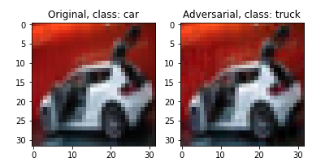
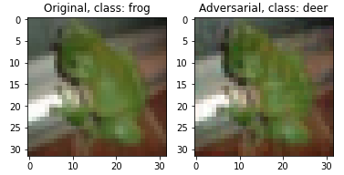
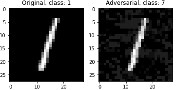
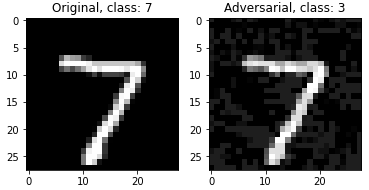

# Adversarial Machine Learning


This repository contains implementation of the Fast Gradient Sign Method (Goodfellow *et al*) and the Projected Gradient Descent (Madry *et al*) to attack neural networks trained on **CIFAR10** and **MNIST** 

Defend the network by performed adversarial training

### File Structure

```bash
├── Attack
│   ├── attack.ipynb				# attack definition and execution
│   ├── cifar_model.pt				# model generated from cifar_model.py
│   ├── cifar_model.py				# train model on CIFAR10
│   ├── mnist_model.net				# pre-trained model on MNIST
│   └── models.py				# model architecture
├── Defence
│   ├── attacks.py				# FGSM and PGD (targeted and untargeted) attacks
│   ├── eval.py					# evaulate model performance
│   ├── models					# Saved model for different training epochs
│   │   ├── Net_1_False
│   │   ├── Net_1_True
│   │   ├── Net_20_False
│   │   └── Net_20_True
│   ├── train.py				# Adversarial training
│   └── utils.py				# utility functions
```

### Attack

```bash
cd Attack
python cifar_model.py
jupyter notebook
```

Execute cells in ```attack.ipynb``` to load the pre-trained models and data and run attacks

  

 

                    


### Defense

Use adversarial training as the defense mechanism

```ba
cd Defense
python train.py --defense --num_epochs 20
```

This will train on MNIST and save the model the model as ```models/Net_{args.num_epochs}_{args.defense}``` 

To evaluate the performance before and after adversarial training on attacked and non-attacked images, run the following command

```bash
python eval.py --defense --num_epochs 20
```

 

### References

Goodfellow et al "[Explaining and harnessing adversarial examples](https://arxiv.org/abs/1412.6572)" ICLR, 2015

Aleksander Madry et al. ”[Towards deep learning models resistant to adversarial attacks](https://arxiv.org/abs/1706.06083)”. ICLR (2018).

